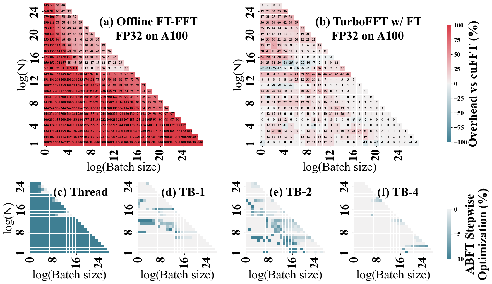

# TurboFFT
TurboFFT is a high performance GPU-based FFT prototype with fault tolerance.


## Run the following command to generate FFT kernels and compile the templates
```
mkdir build
./compile.sh
```

## TurboFFT

### Run the following command to benchmark TurboFFT without fault tolerance

```
./turbofft --if_bench 2  --thread_bs 1 --gpu A100 --datatype 0 --if_ft  0  --if_err 0
./turbofft --if_bench 2  --thread_bs 1 --gpu A100 --datatype 1--if_ft  0  --if_err 0
```


### Run the following command to benchmark TurboFFT without fault tolerance

```
./turbofft --if_bench 2  --thread_bs 1 --gpu A100 --datatype 0 --if_ft  1  --if_err 0
./turbofft --if_bench 2  --thread_bs 1 --gpu A100 --datatype 1 --if_ft  1  --if_err 0
```




### Run the following command to benchmark TurboFFT without fault tolerance
```
./turbofft --if_bench 2  --thread_bs 1 --gpu A100 --datatype 0 --if_ft  1  --if_err 1
```


### Reference Benchmark Result in data and data_ft

### Usage

```
Usage: program [options]
Options:
  --logN <value>       Set logN to <value>, which determines N as 2^<value>.
  --bs <value>         Set block size to <value>.
  --bs_end <value>     Set block size end to <value> (for iterative tests).
  --bs_gap <value>     Set block size gap to <value> (for iterative tests).
  --if_profile <0|1>   Enable (1) or disable (0) profiling.
  --if_verify <0|1>    Enable (1) or disable (0) verification.
  --if_bench <0|1|2|11|12> Enable (1) or disable (0) benchmarking.
                           (2) for logBS + logN = 28.
                           (11) for cuFFT.
                           (12) for cuFFT &  logBS + logN = 28.
  --if_ft <0|1>        Enable (1) or disable (0) fault tolerance.
  --if_err <0|1>       Enable (1) or disable (0) error injection.
  --datatype <type>    0 for FP32, 1 for FP64.
  --thread_bs <value>  Set number of global memory transactions
                       per threadblock to <value>.
  --gpu <str>          Set GPU spec.
  -h, --help               Display this help message and exit.
```


## Set your kernel parameters!

|logN | Kernel Launch Times | logN1 |logN2 |logN3 | BS1| BS2| BS3 | n1| n2| n3|
|--|--|-|--|--|--|--|--|--|--|--|
|7| 1| 7| 0| 0| 1| 0| 0| 8| 0| 0|
|8| 1| 8| 0| 0| 1| 0| 0| 16| 0| 0|
|9| 1| 9| 0| 0| 1| 0| 0| 8| 0| 0|
|10| 1| 10| 0| 0| 1| 0| 0| 8| 0| 0|
|11| 1| 11| 0| 0| 1| 0| 0| 8| 0| 0|
|12| 1| 12| 0| 0| 1| 0| 0| 16| 0| 0|
|13 |1 |13| 0| 0| 1| 0| 0| 32| 0| 0|
|14 |2 |7 |7| 0| 16| 16| 0| 8| 8| 0|
|15 |2 |7 |8| 0| 16| 8| 0| 8| 8| 0|
|23| 3| 7| 8| 8| 32| 16| 16|  16| 16| 16
|24| 3| 8| 8| 8| 16| 16| 16|  16| 16| 16

Some parameters combination may not work, for example you should make sure $BS_i \times logN_i \leq max\_shared\_memory\_size$
1. You can config your own kernel parameters by edit the parameter file in `include/param/param_A100_double2.csv`
2. Run the following command to regenerate the kernel code and compile again
```
./compile.sh
```

## Fault Tolerance mode and Error Injection Mode

1. Modify the code generator `fft_codegen.py` arguments

| Parameter        | Type  | Default Value | Description                                              |
|------------------|-------|---------------|----------------------------------------------------------|
| `if_ft`          | int   | 0             | Flag to indicate fault detection (0 for False, 1 for True) |
| `if_err_injection` | int   | 0             | Flag to indicate error injection (0 for False, 1 for True) |
| `err_smoothing`  | int   | 1000          | Error smoothing parameter                                |
| `err_inj`        | int   | 100           | Error injection value                                |
| `err_threshold`  | float | 1e-3          | Error threshold                                          |
| `datatype`       | str   | "double2"     | Data type with a default value of "double2"              |

1. Run the following command to 
```
cd include/code_gen/scripts
python fft_codegen.py --datatype="double2" --if_ft=1  --if_err_injection=1 
```

## We currently only support radix-2
